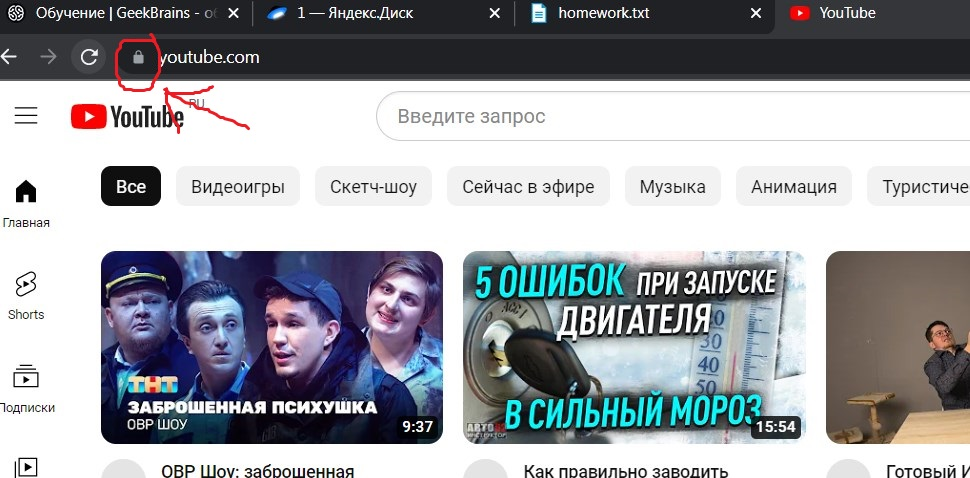
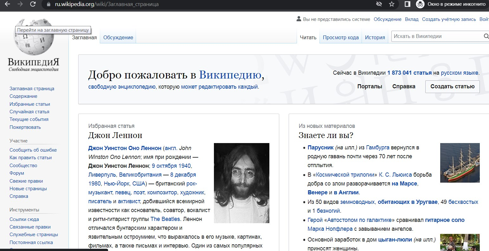
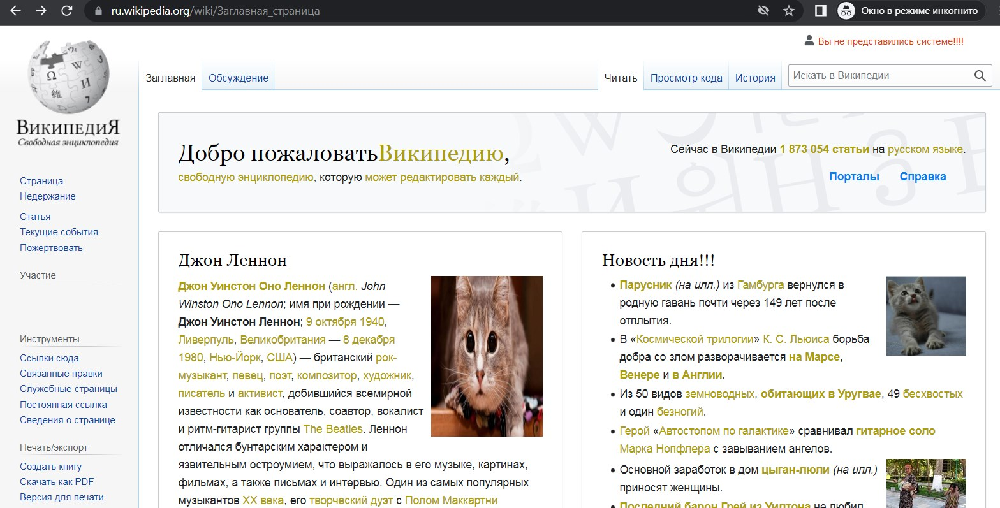
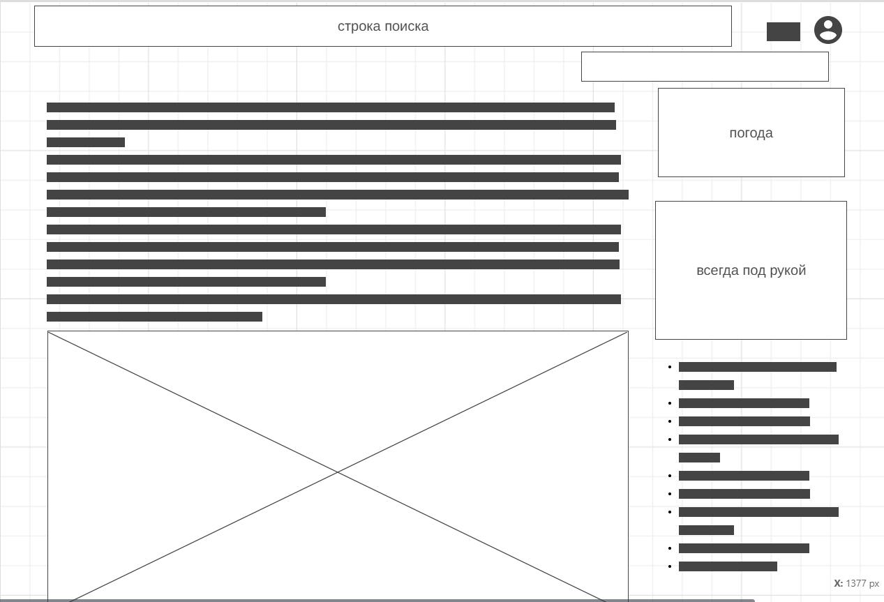

1. Определите, на каком протоколе работает сайт youtube.com.

Сделайте скриншот с названием 1_protocol.jpg, по которому станет понятно, как вы определили протокол сайта.

По замочку можно определить, что сайт youtube.com работает по протоколу https

3. Внесите не менее 10 изменений на страницу любой статьи сайта https://ru.wikipedia.org/, 
с помощью инструмента разработчика и представьте два скриншота было/стало 
(скриншоты должны иметь названия 3_before.jpg, 3_after.jpg соответственно). 
Желательно поработать с изменением текста на странице, 
заменой картинки, изменением стилей.

4. Создайте прототип низкой детализации сайта 
https://dzen.ru/ с помощью сайта https://wireframe.cc/. 
Предоставьте скриншот того, что получилось 
(скриншот должен быть назван 4_proto.jpg).

